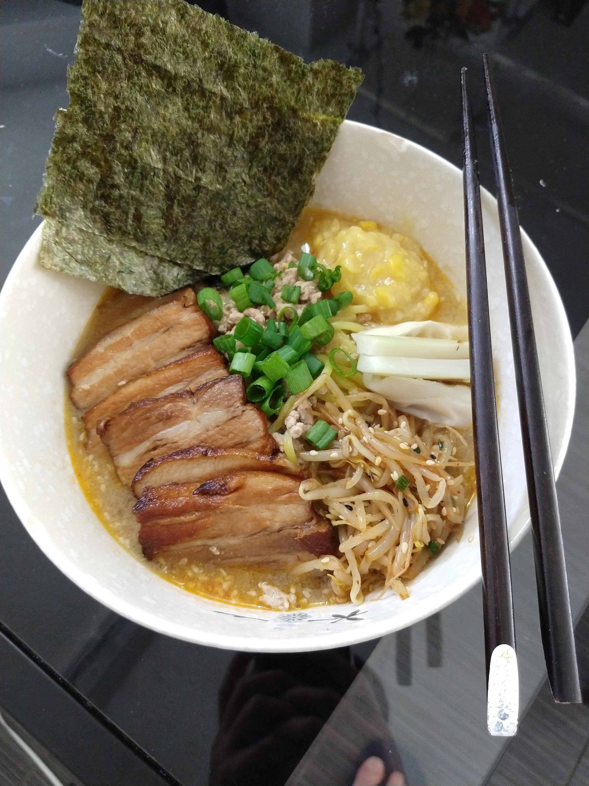
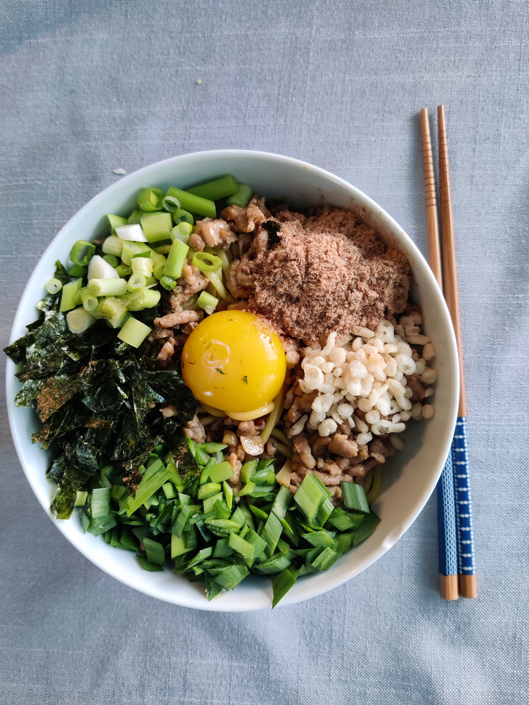
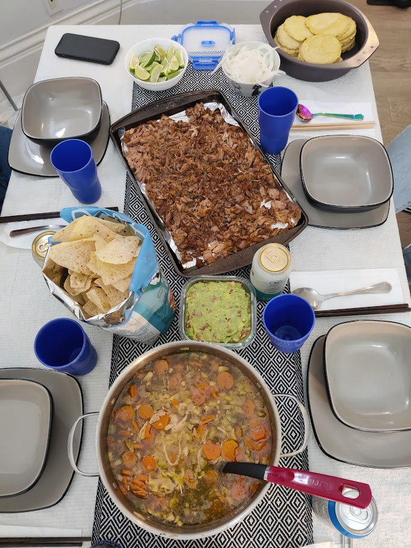

### Hi there welcome to my food blog👋

I like cooking for people. Here are some things I've made recently (while also practicing my floundering Markdown abilities):
<ul>
  <li>This is some <b>ramen</b> I made. Unfortunately I bought creamed corn instead of corn, so that explains the congealed mess at the top.</li>
      

  <li>This is <b>mazesoba</b>, a dry ramen with many delicious toppings!</li>
      

  <li>You already know that I made a Christmas feast</li>
      

  <li>A couple weeks ago, I slowcooked some carnitas and made my own chicken noodle soup from scratch!</li>
      
</ul>

I also enjoy hosting dinner parties. Here are a couple:

<a href="https://www.instagram.com/reel/Cx0xkFeOxy-/">A farewell party for one of our friends</a>

<a href="https://www.instagram.com/reel/CvX90AkAwaB/">Italian night</a>

Finally, here's one of my favourites:

https://github.com/clew3/clew3/assets/38803188/c8cf19a3-daf8-4399-bcdc-506a936ad5f2

